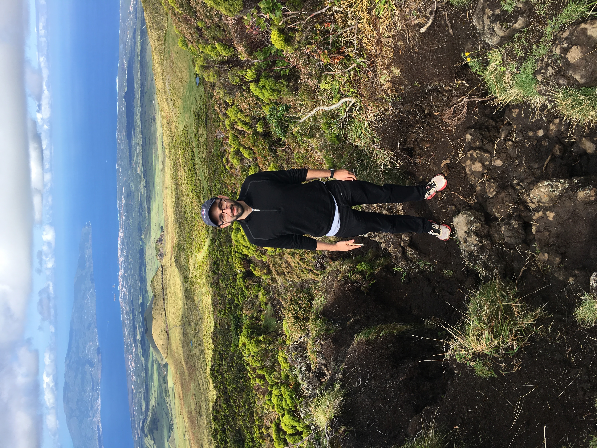

<!-- This won't be displayed but it will initialize your R session. Add any R libraries you need here. -->
```{r init,include=FALSE,echo=FALSE}
library(magrittr)
library(knitr)
readLines('https://www.zotero.org/api/users/4668375/items/top?limit=25&format=bibtex&key=FBIr7Fsgjnh7a3sK6mZNzB7S&v=1') %>% writeLines('references.bib')
```


# Welcome! {-}

<!-- You can include images saved within your repo... -->
```{r echo=FALSE,fig.cap='This is me, hiking in Azores, 2016.',fig.align='center',out.width='50%'}

```

Hi, I'm Jake and this is my project page for W201 Research Design and Applications for Data Analysis (RDADA). This site will contain my two "cool ideas." 

<!-- Below this line is just examples of how you can embed video from Google Drive. First you have to enable sharing, then just get the object ID which is that long string between d/ and /preview and will also be appended to any sharing link you generate for your video. -->
<p>
```{r hello-benji,echo=FALSE,fig.cap='Hello Benjamin Franklin!',fig.align='center'}
knitr::include_url('https://drive.google.com/file/d/0B6bobRDQR96iVEV3SXJJal9CczQ/preview')
```

### Abstract of my first cool idea {-}

Within the last few years, researchers, environmentalists, farmers, and grocers have all grappled with the idea of reducing or reusing edible food waste. One primary outlet for edible waste is food banks, who then distribute the food to needy populations, many of whom do not have regular access to fruits and vegetables. The Food Forecaster helps food banks use data to predict near-term donations from regular donors. This tool could help food banks plan for upcoming shortages, know when to leverage alternate acquisition sources, and redirect surpluses to other banks to prevent waste of their own.

### Abstract of my second cool idea {-}

Public transit use is in decline in many cities largely due to the advent of services such as Lyft and Uber. If public transit agencies do not adequately re-engage consumers before autonomous vehicle (AV) usage becomes the norm, it will likely be unable to win consumers back. In addition to the potential degradation of public transit, a mass shift to individual cars would be disastrous for GHG emissions. 

This project seeks to help public transit entities pilot microtransit services to bolster or augment current public transit capabilities. Unlike previous microtransit trials, we will use data to determine areas of highest public transit need and lowest transit availability, linking to existing transit where possible. This system allows for quick, testable expansion of public transit networks without the cost of building rail or other inflexible systems.

## About the author {-}

This portfolio is part of my first steps toward a career in data science. I was drawn toward data science because of the potential to solve deep, meaningful, and complex issues, and I believe data science can be used toward making the world a better place. I currently work as a proposal manager for a mid-size IT services company that serves government health and human services organizations. I previously served as a marketing and proposal consultant, and before that as a newspaper writer. My interests include cooking (always happy to recommend a recipe or, if you're visiting DC, a restaurant), soccer, and tennis. I am a native of Asheboro, NC, received a bachelor's degree in history from Princeton, and live in Washington, DC.

*Updated: `r Sys.Date()`*
